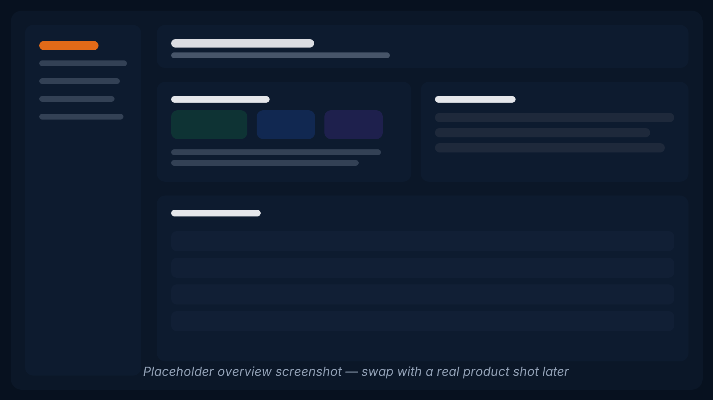
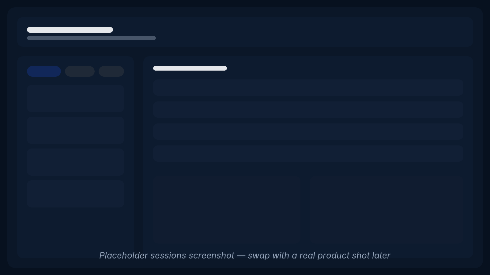

# Hermes Console

A local-first dashboard for inspecting a real Hermes Agent setup without spelunking through the terminal.

Hermes Console gives you one calm place to check runtime health, session history, cron state, skills, memory, and key config files. It is intentionally read-mostly: visibility first, control later.

## Screenshots

> Temporary placeholders for now — good enough for a quick OSS pass.

### Overview



### Sessions



## What you get

- **Overview** — runtime health, gateway status, platform connectivity, warnings, and environment snapshot
- **Sessions** — browse past runs with filtering by agent, platform, and source
- **Cron** — inspect jobs, recent runs, outputs, and failure state
- **Skills** — browse installed skills and linked references/templates/scripts
- **Memory** — inspect `MEMORY.md` and `USER.md` with pressure indicators
- **Files** — preview the key config and context files that shape Hermes behaviour
- **Usage** — token and estimated cost visibility from local session data

## Why it exists

Hermes is strong in the terminal, but once you have a real setup — multiple agents, cron jobs, memory files, sessions, and platform adapters — basic visibility gets messy fast. Hermes Console turns that runtime sprawl into a product-shaped local UI.

This is not trying to be a generic multi-agent control plane. It is a focused operator surface for Hermes.

## Quick start

```bash
git clone https://github.com/giles-io/hermes-console.git
cd hermes-console
pnpm install
cp .env.example .env.local
pnpm dev
```

Then open [http://localhost:3000](http://localhost:3000).

By default, Hermes Console reads from your local Hermes state under `~/.hermes`.

## Configuration

Copy `.env.example` to `.env.local` and adjust as needed.

| Variable | Default | Description |
|----------|---------|-------------|
| `HERMES_CONSOLE_HERMES_DIR` | `~/.hermes` | Hermes state root |
| `HERMES_CONSOLE_WORKSPACE_DIR` | `~` | Workspace root used for context/config file discovery |

## Stack

- Next.js
- React
- TypeScript
- Tailwind CSS
- No separate app database — the UI reads Hermes state directly from disk

## Development

```bash
pnpm dev
pnpm build
pnpm test
pnpm lint
```

## Product stance

- **Read-mostly** — start with visibility, not mutation
- **Local-first** — runs on localhost against local Hermes state
- **Calm, dense UI** — useful signal without dashboard theatre
- **Hermes-native** — built around actual Hermes runtime surfaces, not abstract AI-tooling fluff

## License

MIT
